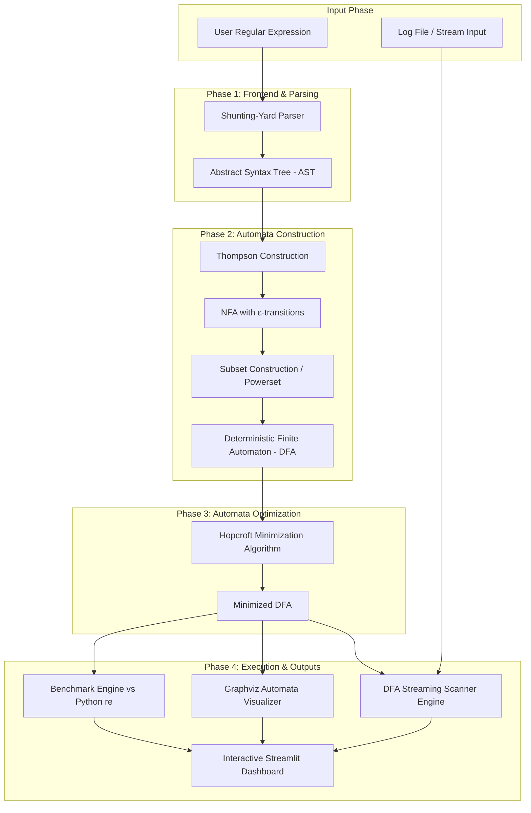

# High-Level Design (HLD) Document — LogScan DFA

## Project Title: LogScan DFA — High-Performance Log Pattern Analyzer using Regular Expressions and Finite Automata
**Course:** BITE306L — Theory of Computation  
**Repository:** [YOGESH-08/Logtron](https://github.com/YOGESH-08/Logtron)

---

## 1. Executive Summary & Problem Statement

Modern log analysis engines rely heavily on Regular Expression (Regex) matching for filtering, parsing, and extracting events from massive stream logs (e.g., Apache access logs, Linux syslog, microservice audit trails). Standard regex implementations in modern runtime environments (such as Python `re`, Java `java.util.regex`, or PCRE) utilize **Nondeterministic Finite Automata (NFA) with Backtracking**. 

While backtracking regex engines support advanced features like backreferences and lookaheads, they introduce a severe vulnerability: **Catastrophic Backtracking** (also known as Regex Denial of Service or **ReDoS**). Under pathological regular expressions (e.g., `(a+)+b` matched against `aaaa...a`), execution time grows exponentially $O(2^n)$ relative to input length, causing application freeze or complete system service outage.

**LogScan DFA** addresses this limitation by implementing a **Deterministic Finite Automata (DFA) pipeline**. By translating user regular expressions into automata via **Thompson Construction** and **Subset Construction**, and minimizing state complexity using **Hopcroft's Algorithm**, LogScan DFA executes log scanning in guaranteed **$O(n)$ linear time** irrespective of regular expression complexity.

---

## 2. Course Mapping (Theory of Computation)

LogScan DFA directly implements the core theoretical principles taught in the Theory of Computation (BITE306L) syllabus:

| Syllabus Module | Theory Topic | Project Implementation / Component |
| :--- | :--- | :--- |
| **Module 1** | DFA, State Minimization, Equivalence | Hopcroft's $O(n \log n)$ Partition Refinement Algorithm, DFA Scanner Engine |
| **Module 2** | NFA, $\epsilon$-transitions, Powerset Construction | Thompson's Construction (AST $\rightarrow$ NFA), Subset Construction with $\epsilon$-closure (NFA $\rightarrow$ DFA) |
| **Module 3** | Regular Expressions, RE $\leftrightarrow$ FA Equivalence | Shunting-Yard Regex Parser, AST Generation, Explicit Concatenation Operator Insertion |

---

## 3. System Architecture & Pipeline Data Flow

LogScan DFA operates as a multi-stage compilation and execution engine. The architecture converts abstract regular expression patterns into optimized finite-state state machines, which are then used to evaluate log streams.

### 3.1 Architectural Dataflow Diagram

---

## 4. Subsystem & Component Specifications

### 4.1 Regex Parser Subsystem
- **Purpose**: Converts raw string regular expressions into an Abstract Syntax Tree (AST).
- **Key Functions**:
  - Insert explicit concatenation operators (`.`) where implicit (e.g., `ab` $\rightarrow$ `a.b`).
  - Convert infix expression to postfix notation via **Shunting-Yard algorithm** respecting operator precedence (`*`, `+`, `?` $>$ Concatenation $>$ Union `|`).
  - Support character classes (e.g., `[a-z]`, `[0-9]`), wildcards (`.`), and escape sequences (`\d`, `\s`, `\w`).

### 4.2 Automata Synthesis Subsystem
- **Thompson Construction Module**:
  - Recursively traverses AST in post-order to generate an NFA with $\epsilon$-transitions.
  - Constructs canonical NFA fragments for base symbols, concatenation, union, Kleene star (`*`), plus (`+`), and optional (`?`) operators.
- **Subset Construction Module**:
  - Computes $\epsilon$-closures of NFA state sets using Breadth-First Search (BFS) / Depth-First Search (DFS).
  - Maps powerset NFA state combinations into discrete DFA states over alphabet $\Sigma$.
  - Tracks initial state and converts any set containing an NFA accept state into a DFA accept state.

### 4.3 Hopcroft Minimization Engine
- **Purpose**: Reduces DFA state count to minimal canonical form in $O(n \log n)$ time.
- **Mechanism**:
  - Initializes initial partition $P = \{ F, Q \setminus F \}$ (Accepting and Non-accepting states).
  - Maintains worklist $W$ of splitting sets.
  - Iteratively refines partitions based on transition behavior under input symbols $a \in \Sigma$.
  - Merges equivalent states and constructs minimal transition graph.

### 4.4 DFA Scanner & Matching Engine
- **Purpose**: Evaluates incoming log text streams character-by-character against the Minimal DFA.
- **Mechanism**:
  - Maintains state pointer initialized to DFA start state $q_0$.
  - Streams log file line-by-line or chunk-by-chunk without full memory loading.
  - Records match span start/end character offsets when accepting states are traversed.
  - Employs per-position restart strategy for arbitrary substring pattern matching across log lines.

### 4.5 Visualizer & Interactive Interface
- **Graphviz Rendering**: Converts DFA transition table into Graphviz DOT syntax. Double-circles accept states, highlights initial state, and labels edges with transition characters.
- **Streamlit Web UI**: Interactive dashboard allowing users to:
  1. Input custom regex patterns.
  2. View NFA vs DFA state reduction metrics.
  3. Inspect interactive/rendered DFA state transition graphs.
  4. Upload real-world log files (Apache access, syslog, app logs) and view highlighted pattern matches.
  5. Run real-time performance benchmarks comparing LogScan DFA against Python's native `re` module.

### 4.6 Benchmark & Evaluation Module
- **Metrics Collected**: Scan throughput (MB/s), execution latency (ms), and state reduction ratios.
- **Pathological Pattern Testing**: Evaluates catastrophic backtracking expressions (e.g., `(a+)+b`) against large log payloads to empirically demonstrate $O(n)$ DFA performance vs exponential NFA backtracking.

---

## 5. Non-Functional Requirements & System Guarantees

1. **Time Complexity Guarantee**:
   - Pattern Construction: $O(|R| \cdot 2^{|R|})$ worst-case theoretical during subset construction (practically $O(|R|)$ for typical log regexes).
   - State Minimization: $O(|S| \log |S|)$ where $|S|$ is DFA state count.
   - **Log Scanning**: Strict $O(n)$ where $n$ is log file length in characters.
2. **Space Complexity**:
   - Memory footprint scales with DFA state table size $O(|S| \cdot |\Sigma|)$, independent of log file length due to streaming processing.
3. **Safety & Robustness**:
   - Complete immunity to ReDoS attacks and CPU exhaustion from untrusted user regexes.

---

## 6. Technology Stack Rationale

| Layer / Component | Technology | Rationale |
| :--- | :--- | :--- |
| **Language** | Python 3.10+ | Fast prototyping of graph/automata data structures and native standard library tools |
| **Visualization** | Graphviz (`graphviz` package) | Clean rendering of finite state automata graphs with DOT language |
| **UI Framework** | Streamlit | Rapid development of interactive multi-page web dashboards |
| **Benchmarking** | `timeit` + `matplotlib` | High-precision timing measurements and comparative visualization charts |
| **Test Suite** | `pytest` | Unit testing of individual automata transformation stages against textbook models |

---

## 7. Technology Readiness Level (TRL) & Intellectual Scope

- **TRL Level**: **TRL 3–4** (Laboratory validation of functional prototype).
- **Aspects Requiring Protection / Intellectual Value**:
  - The specific integrated pipeline combining Shunting-Yard AST parsing, Thompson-Subset-Hopcroft reduction, streaming char-by-char scanner, and real-time state visualization.
